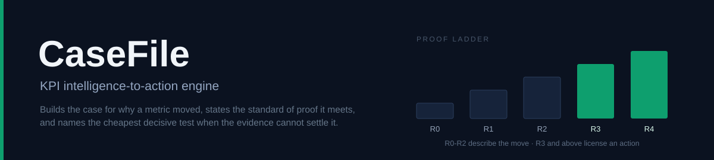

# CaseFile

[](https://github.com/priyadip/BusinessIntelligence.ai-/actions/workflows/ci.yml)
[](tests/)
[](results/rubric.json)
[](https://www.python.org/downloads/)
[](RUNBOOK.md)
[](results/llm_invariance.json)
[](LICENSE)

[](docs/ARCHITECTURE.md)

**CaseFile turns a KPI movement into a decision.** It decomposes the move, ranks the
candidate causes, and states the standard of proof each explanation actually meets. When the
evidence cannot identify a cause, it declines to name one, and instead ranks the experiments
that would settle the question by expected net benefit.

> The dashboard reports the number. CaseFile builds the case for why it moved, states the
> standard of proof that case actually meets, and when the evidence cannot settle it, names
> the cheapest test that will.

Round 2 prototype for the Accenture Innovation Challenge, track *BusinessIntelligence.ai*.
Vantage Retail Group is fictional. All data is synthetic or public. No proprietary data from
any real organisation is used or implied.

## Table of contents

- [Overview](#overview)
- [Why a BI system should be allowed to decline](#why-a-bi-system-should-be-allowed-to-decline)
- [Benchmark](#benchmark)
- [Installation](#installation)
- [Quick start](#quick-start)
- [Usage](#usage)
- [The one thing to look at](#the-one-thing-to-look-at)
- [Repository layout](#repository-layout)
- [Documentation](#documentation)
- [Testing](#testing)
- [Continuous integration](#continuous-integration)
- [Data provenance](#data-provenance)
- [Limitations](#limitations)
- [Contributing](#contributing)
- [Citation](#citation)
- [Licence](#licence)

## Overview

A KPI moves. Every BI product on the market can tell you by how much, decompose it by
dimension, and write a fluent paragraph about the largest contributor. None of them will tell
you whether that contributor is the *cause*, and none of them will refuse to answer when the
data cannot say.

CaseFile is organised around a **proof ladder**. Every causal claim it makes is assigned a
rung, and the grammar available to the narrative is constrained by that rung: the word
"caused" is unavailable below R3.

| Rung | Standard of evidence | What may be said |
|---|---|---|
| **R0** | Arithmetic | the metric decomposes this way |
| **R1** | Association | this driver moved alongside it |
| **R2** | Temporal precedence and a stated mechanism | this driver preceded it, and a mechanism links them |
| **R3** | Quasi-experimental identification, with a control | this driver caused it |
| **R4** | Measured under a pre-registered randomised test | this driver caused it, and the effect size is known |

Below R3, CaseFile abstains with a **typed reason** rather than a hedge. The taxonomy is
closed and each type routes to a different remedy: `collinear_causes`, `underpowered`,
`missing_evidence`, `contradictory_evidence`, `out_of_library`, `stale_source`,
`sparse_history`, `budget_exceeded_latency`, `entitlement_limited`.

The whole system is driven by one executable artifact, [`config/kpi_contract.yaml`](config/kpi_contract.yaml):
KPIs, thresholds, drivers, lineage, levers, personas, access policy and the proof-ladder
policy itself. It is not documentation. Changing it changes behaviour.

## Why a BI system should be allowed to decline

Anomaly detection, contribution analysis, natural-language narratives and agentic hypothesis
testing all ship today across the BI market. What no product we could find will do is
**decline**.

When two operational changes land in the same week, on the same customers, in the same
region, no control group exists and the cause is not identified. A system that must answer
will name one of them. It will be right about half the time, and the half it gets wrong is
paid for in reversed price changes, cancelled promotions and misdirected engineering.

CaseFile treats that situation as a first-class outcome with a name, a reason code, and a
ranked list of the experiments that would resolve it.

## Benchmark

Measured over <!--NUMBERS:n-->300<!--/NUMBERS:n--> seeded incidents with injected ground truth, where roughly a third are
unidentifiable *by construction*:

<!--NUMBERS:table-->
| Measure | Contribution-ranking baseline | CaseFile |
|---|---|---|
| Top-1 cause accuracy, identifiable | 99.5% | **100.0%** |
| Answer rate, identifiable | 100% | 66.7% |
| **Wrong lever pulled, unidentifiable** | **38.2%** | **0.0%** |
| Abstention rate, unidentifiable | 0% | 100.0% |
<!--/NUMBERS:table-->

Both systems see identical evidence. The baseline is the standard industry pattern
implemented faithfully, not a strawman: decompose, take the largest contributor, report it as
the cause, never abstain. Its top-1 accuracy is excellent *when a cause is identifiable*. The
difference is entirely in what happens when one is not.

Ground truth is exact Shapley values computed over counterfactual re-simulations of the
world, so "the true cause" is a computed quantity rather than a label.

## Installation

CaseFile requires **Python 3.10 or newer**. Clone and run the one-command setup:

```bash
git clone https://github.com/priyadip/BusinessIntelligence.ai-.git
cd BusinessIntelligence.ai-
./setup.sh
```

That installs dependencies, generates the synthetic world (deterministic, about 40 seconds)
and runs all four incidents. Then open `results/workspace.html` in any browser: one
self-contained file, no server, no network.

To install the dependencies alone:

```bash
pip install -r requirements.txt
```

The optional narrative layer needs a second set, and is not required for any number the
system produces:

```bash
pip install -r requirements-llm.txt
```

**The warehouse is generated, not committed.** It is 125 MB, which exceeds GitHub's 100 MB
file limit, and it is fully reproducible from its seed. A clean clone is about 1.2 MB and
rebuilds an identical world, reproducing the same deltas, verdicts and test results.

## Quick start

```bash
cd src
python3 -m casefile.sim.build_all 20260901   # generate the world
python3 run_case.py all --llm-mode off       # all four incidents, no model involved
```

Open `results/workspace.html`. Four incidents are shipped, and only one of them ends in an
action:

| Incident | KPI | Move | Verdict | Rung |
|---|---|---|---|---|
| INC-001 | conversion_rate, WEST | -12.17% | **ACT** | R3 |
| INC-002 | net_revenue, KITCHEN + DECOR | -7.38% | ABSTAIN `collinear_causes` | R2 |
| INC-003 | avg_order_value, SMART_HOME | +4.12% | ABSTAIN `sparse_history` | R2 |
| INC-004 | gross_margin_pct | +0.00% | ABSTAIN `stale_source` | R1 |

## Usage

```bash
cd src

python3 run_case.py INC-002                  # one incident
python3 run_case.py all --llm-mode off       # all four, deterministic
python3 run_seeded.py 4271                   # a world drawn from a seed you pick
python3 -m pytest ../tests -q                # 25 tests
python3 verify_rubric.py                     # score against the Round 2 brief
python3 eval/run_batch.py -n 300 --workers 8 # held-out evaluation
python3 eval/tier2_real.py                   # the same statistics on real public data
python3 sync_numbers.py                      # regenerate every figure quoted in the docs
```

Optional, for generated prose. Every computed number is identical without it:

```bash
python3 run_case.py all --llm-mode local     # local Qwen2.5 1.5B + 14B
```

`run_seeded.py` exists so that a reviewer can pick a seed CaseFile has never been run
against, and watch it decide in the open.

## The one thing to look at

`results/workspace.html`, incident **INC-002**. Net revenue is 6% below a
seasonality-and-covariate-adjusted expectation. A price rise and a promotion ending landed a
day apart, nationally, on the same categories, so no control group exists and neither can be
established.

The engine says so. It ranks the experiments that would settle the question by expected net
benefit per day, picks the free reversible one over the one that costs 340,000, and proposes
a hedge for the interim. Then the loop section shows that test actually being run, measured
at +8.02%, and written back into the contract as a promoted edge at R4.

That last step is the point. The contract that governed the decision is updated by the
outcome of the decision, and the next incident inherits a measured effect where it previously
had an assumed one.

## Repository layout

```
README.md                 you are here
RUNBOOK.md                how to run it, and a timed demo script
FINAL_REPORT.md           what was built, what was tested, what does not work
CITATION.cff              citation metadata
config/
  kpi_contract.yaml       the executable contract: KPIs, thresholds, drivers, lineage,
                          levers, personas, security policy, proof-ladder policy
  routing.yaml            per-stage model routing, with a justification for each choice
setup.sh                  fresh clone to running prototype in one command
requirements.txt          core engine
requirements-llm.txt      optional, only for local narrative generation
src/
  casefile/               the engine (sim, semantic, security, engine, llm, telemetry, render)
  run_case.py             CLI: run one incident or all four
  run_seeded.py           CLI: draw a random incident from a seed a reviewer picks
  verify_rubric.py        mechanical scoring against the Round 2 brief
  sync_numbers.py         regenerates every headline figure in the docs from the canonical
                          evaluation, so prose and results cannot drift apart
  eval/                   batch evaluation, likelihood calibration, LLM-invariance proof
  baselines/              the industry-standard comparator
scripts/
  fetch_public_data.py    downloads the third-party UCI dataset on demand
data/
  likelihood_table.json   the calibrated evidence model, measured on 500 incidents from seeds
                          disjoint from evaluation, plus the locked temperature. Versioned,
                          because it is a trained artifact rather than a build product.
  (generated, not committed)
  vantage.duckdb          the warehouse: 3 schemas, 11 tables, 1.2M orders, 125 MB
  ground_truth.json       exact Shapley values over 64 counterfactual re-simulations
  documents.jsonl         4,006 anchored documents, about 74% unrelated to any incident
results/
  workspace.html          the Decision Workspace
  cases/*.json            full case files for the four incidents
  eval/summary.json       the benchmark table above
  rubric.json             brief coverage
  llm_invariance.json     the model-off versus model-on comparison
  loop_INC-002.json       the closed loop, pre-registration through measured outcome
tests/                    25 tests, including the two architectural invariants
docs/                     architecture, capability provenance
```

## Tier-2: the engine against real data

Every other number in this repository is measured on a world the author simulated. The
Tier-2 pass runs the same machinery over 1,067,371 real UK transactions:

```bash
python3 scripts/fetch_public_data.py     # once, needs the internet
cd src && python3 eval/tier2_real.py     # about 8 seconds
```

Two of its four tests are negative controls that were free to fail, and one did:

| Test | Result |
|---|---|
| Exact decomposition on real segments | residual `2.8e-13`, **closes** |
| Synthetic control on dates with no intervention | **6.1%** spurious R3 against a 10% threshold, conservative |
| Detector fire rate on windows where nothing happened | **27.9%** at a nominal 1%, a 28-fold overshoot |
| The same, February to August only | **0.83%** at a nominal 1%, calibrated |

The detector failure is entirely seasonal and has an exact cause: the annual cycle needs
two full periods and this source has 2.02 years of trading days, so Christmas is never
modelled. Full write-up, including the recovery-of-a-known-shock results, in
[`docs/TIER2_REAL_DATA.md`](docs/TIER2_REAL_DATA.md).

## Documentation

| Document | Contents |
|---|---|
| [`RUNBOOK.md`](RUNBOOK.md) | every command, a ten-minute demo script, troubleshooting |
| [`docs/ARCHITECTURE.md`](docs/ARCHITECTURE.md) | the thirteen layers, and why each exists |
| [`docs/TIER2_REAL_DATA.md`](docs/TIER2_REAL_DATA.md) | the engine measured on real public data, including two negative controls |
| [`docs/CAPABILITY_PROVENANCE.md`](docs/CAPABILITY_PROVENANCE.md) | what is native, configured, custom or externally integrated |
| [`FINAL_REPORT.md`](FINAL_REPORT.md) | what was built, what was measured, the twelve bugs found, and the limitations |
| [`config/kpi_contract.yaml`](config/kpi_contract.yaml) | the contract that drives every query, access decision and threshold |

## Testing

```bash
cd src && python3 -m pytest ../tests -q
```

25 tests. Two of them are architectural invariants rather than unit tests, and are the two
worth reading:

- **`test_llm_boundary.py`** asserts that no quantitative stage can reach a language model.
  The boundary is enforced in three places, not one: the routing table declares
  `backend: none` for every computed stage, the gateway raises `PermissionError` if a
  quantitative span requests a model, and telemetry records a `violates_llm_boundary` flag
  that the test asserts is never set.
- **`test_choke_point.py`** asserts that every query reaching the warehouse passed through
  the semantic gateway, so no code path can quietly bypass contract-defined access policy.

The invariance claim is checked empirically as well as structurally. Running the same
incident with the model off and on produces identical values across <!--NUMBERS:fields-->258<!--/NUMBERS:fields--> computed
fields, to a relative tolerance of 1e-12, with a worst observed difference of <!--NUMBERS:worst-->9.5e-14<!--/NUMBERS:worst-->.
Only the prose changes. See [`results/llm_invariance.json`](results/llm_invariance.json).

## Continuous integration

Every push to `main` builds the synthetic world from scratch on Python 3.10 and 3.13, runs
all four incidents, runs the test suite, and scores the result against the Round 2 brief. The
badge at the top of this file reflects that run. Because the world is generated from a seed
rather than committed, CI verifies reproducibility as a side effect: if the build were not
deterministic, the shipped verdicts would not match.

## Data provenance

- **Vantage Retail Group is fictional.** The warehouse, the document corpus and every
  incident are generated by the simulator in `src/casefile/sim/`. No proprietary data from
  any real organisation is used or implied.
- **Synthetic personal data.** The generated support tickets contain fabricated names, phone
  numbers and addresses at the reserved `mail.example` domain. They are not real people, and
  the PII shield redacts them before anything reaches a model or a narrative.
- **Third-party data is fetched, not redistributed.** `scripts/fetch_public_data.py`
  downloads UCI Online Retail II on demand, under its own terms. It is used by the Tier-2
  pass described below, which runs the engine's statistics against data nobody here
  generated.

## Limitations

Stated in full in [`FINAL_REPORT.md`](FINAL_REPORT.md). The short version: the causal
identification is only as good as the contract's declared lineage; the synthetic world is
generated by the same author as the engine that analyses it, which is a real threat to
external validity; and the abstention taxonomy is closed, so a genuinely novel failure mode
falls into `out_of_library` rather than being characterised.

## Contributing

Issues and pull requests are welcome at
<https://github.com/priyadip/BusinessIntelligence.ai-/issues>.

If you are changing behaviour, note that `config/kpi_contract.yaml` is executable: a change
there is a change to the system, and the tests will hold you to it. Run the suite and the
rubric before opening a pull request:

```bash
cd src && python3 -m pytest ../tests -q && python3 verify_rubric.py
```

If you change anything the documentation quotes a number from, run `python3 sync_numbers.py`
rather than editing the figure by hand. Numbers in the prose are generated from
`results/eval/summary.json`, and that is deliberate.

## Citation

```bibtex
@software{sau_casefile_2026,
  author  = {Sau, Priyadip},
  title   = {{CaseFile}: a {KPI} intelligence-to-action engine},
  year    = {2026},
  url     = {https://github.com/priyadip/BusinessIntelligence.ai-},
  license = {MIT}
}
```

## Licence

MIT, see [`LICENSE`](LICENSE). Chosen as the conventional default for a portfolio and
competition submission: it lets a reviewer clone, run and quote the work without friction.
